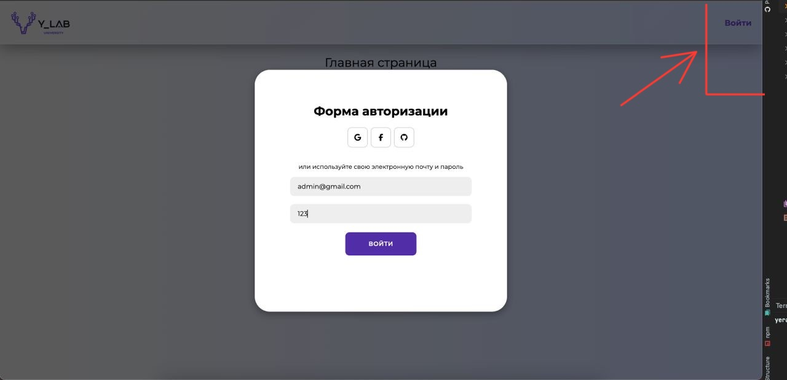
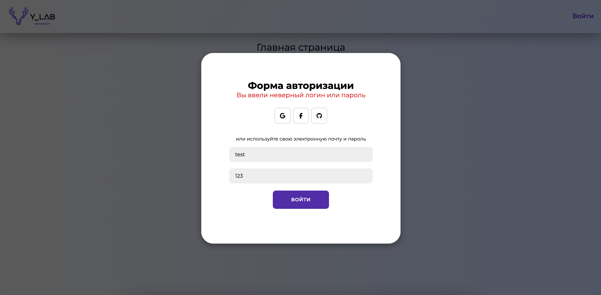

## Важно!

```bash
В проект подключены json-server и axios. Можно было бы создать удалённый сервер и настроить Nginx для взаимодействия с ним.
```

## Запуск проекта

```bash
npm install - установка зависимости
npm run start:dev - запуск сервера
```

## Архитектура проекта

Проект написан в соответствии с методологией Feature sliced design
Ссылка на документацию - https://feature-sliced.design/docs

## Скриншоты






